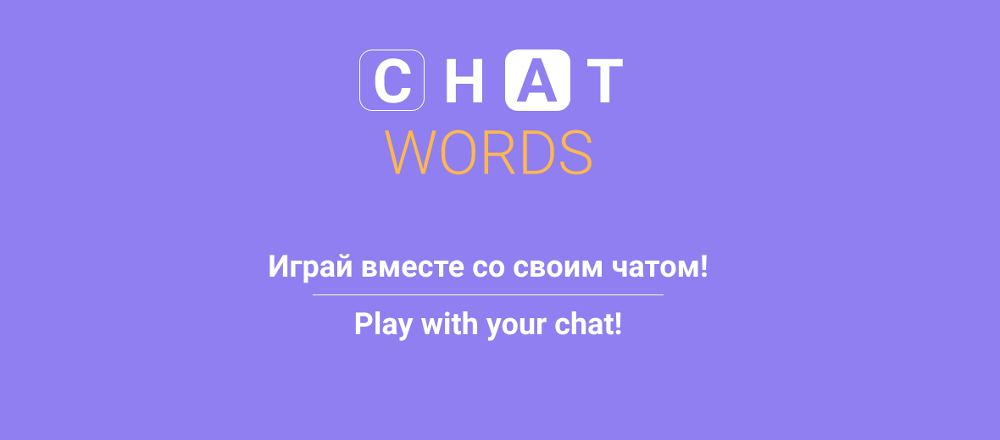

# Chat Words

<a href="#">
  </a>
<a href="https://chatwords.ml" alt="Website">
  </a>
<a href="https://vuejs.org" alt="VueJS">
  </a>


### 


## 👁‍🗨 About

This app is a browser-based game with Twitch chat integration. You are given a random set of letters from which you and your viewers must make possible words. The game has a level and score system and gets harder over time.

Currently supported languages:

- Russian


You can play it here: **[PLAY NOW](https://chatwords.ml/)**


## 🛠Project setup

```
npm install
```

**Compiles and hot-reloads for development**

```
npm run serve
```

**Compiles and minifies for production**

```
npm run build
```

**Lints and fixes files**

```
npm run lint
```

**Customize configuration**

See [Configuration Reference](https://cli.vuejs.org/config/).


## 💥 Errors and suggestions

You can send information about a bug or your suggestion here: [https://github.com/VirtualZer0/ChatWords/issues/new/choose](https://github.com/VirtualZer0/ChatWords/issues/new/choose)
